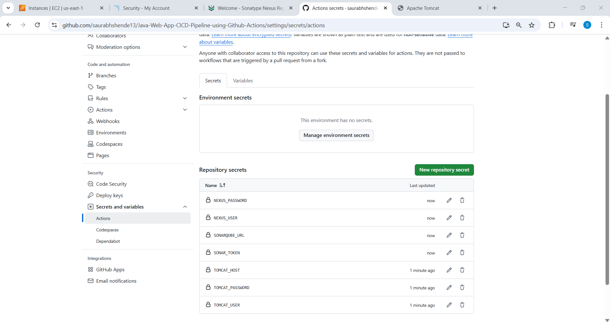

# Java WebApp CI/CD Pipeline using GitHub Actions, SonarQube, Nexus & Tomcat


This project demonstrates how to build a complete CI/CD pipeline using **GitHub Actions** to deploy a Java web application to **Apache Tomcat** on an EC2 server. The pipeline also integrates with **SonarQube** for code quality analysis, **Nexus Repository** for artifact storage, and includes optional **notifications** via email or Slack.

---

## 🚀 Tech Stack Used
- GitHub Actions
- Apache Tomcat 9
- SonarQube (Docker)
- Nexus Repository Manager 3
- Maven
- Java 11/17
- Ubuntu Server
- Notifications via Email (Optional)

---

## 📌 Step 1: Setup Tomcat, SonarQube & Nexus Artifactory Server


### 🔧 Install Apache Tomcat
```bash
sudo apt update && sudo apt upgrade -y
sudo apt install openjdk-17-jdk -y
sudo apt install tomcat9 tomcat9-admin tomcat9-common -y
sudo systemctl start tomcat9
sudo systemctl enable tomcat9
```

**Edit `tomcat-users.xml` to add user roles:**
```xml
<role rolename="manager-gui"/>
<role rolename="manager-script"/>
<user username="tomcat" password="tomcat123" roles="manager-gui,manager-script"/>
```

**Edit `context.xml` to allow remote deployment:**
Comment out this line:
```xml
<!-- <Valve className="org.apache.catalina.valves.RemoteAddrValve"
     allow="127\..+|::1|0:0:0:0:0:0:0:1" /> -->
```


### 🔧 Install SonarQube via Docker
```bash
sudo apt update -y
sudo apt install docker.io -y
sudo docker run -itd --name sonarqube -p 9000:9000 sonarqube:lts
```


### 🔧 Install Nexus Repository
```bash
sudo apt update -y
sudo apt install openjdk-8-jdk -y
cd /opt
sudo wget https://sonatype-download.global.ssl.fastly.net/repository/downloads-prod-group/3/nexus-unix-x86-64-3.78.0-14.tar.gz
sudo tar -xvf nexus-*.tar.gz
sudo mv nexus-3.78.0-14 nexus
sudo /opt/nexus/bin/nexus start
```


---

## 📌 Step 2: Create SonarQube Token

- Log in to SonarQube
- Navigate to **My Account > Security**
- Generate a new token


---

## 📌 Step 3: Create Repository Secrets

Go to your GitHub Repo:
**Settings > Secrets and Variables > Actions > New Repository Secret**

Add the following:
| Key              | Value                            |
|------------------|----------------------------------|
| SONARQUBE_URL    | http://<SONARQUBE_HOST>:9000     |
| SONAR_TOKEN      | Your SonarQube token             |
| NEXUS_USER       | Nexus username                   |
| NEXUS_PASSWORD   | Nexus password or token          |
| TOMCAT_USER      | Tomcat username                  |
| TOMCAT_PASSWORD  | Tomcat password                  |
| TOMCAT_HOST      | Tomcat server IP:8080            |
| EMAIL_TO         | Email address to receive alerts  |




---

## 📌 Step 4: Update `pom.xml`

- Add `distributionManagement` to deploy to Nexus:
```xml
<distributionManagement>
  <repository>
    <id>nexus</id>
    <url>http://<NEXUS_HOST>:8081/repository/maven-releases/</url>
  </repository>
</distributionManagement>
```

- Or use `maven-snapshots` for snapshot versions.


---

## 📌 Step 5: Create GitHub Actions Workflow

- File: `.github/workflows/cicd.yml`
- Define CI/CD pipeline: Checkout > Build > SonarQube > Nexus Upload > Tomcat Deploy > Notify (Optional)
```yaml
name: Build and Deploy Java App to Tomcat on AWS EC2

on:
  push:
    branches: [ "main" ]

jobs:
  build:
    runs-on: ubuntu-latest

    steps:
    - name: Checkout code
      uses: actions/checkout@v3

    - name: Set up JDK 11
      uses: actions/setup-java@v2
      with:
        distribution: 'adopt'
        java-version: '11'

    # SonarQube Analysis
    - name: SonarQube Scan
      env:
        SONAR_TOKEN: ${{ secrets.SONAR_TOKEN }}
      run: |
        mvn sonar:sonar -f MyWebApp/pom.xml \
          -Dsonar.projectKey=MyWebApp \
          -Dsonar.host.url=${{ secrets.SONARQUBE_URL }} \
          -Dsonar.login=$SONAR_TOKEN

    # Configure Maven settings.xml for Nexus
    - name: Configure Maven settings.xml for Nexus
      env:
        NEXUS_USERNAME: ${{ secrets.NEXUS_USER }}
        NEXUS_PASSWORD: ${{ secrets.NEXUS_PASSWORD }}
      run: |
        mkdir -p ~/.m2
        echo '<?xml version="1.0" encoding="UTF-8"?>' > ~/.m2/settings.xml
        echo '<settings xmlns="http://maven.apache.org/SETTINGS/1.0.0"' >> ~/.m2/settings.xml
        echo '         xmlns:xsi="http://www.w3.org/2001/XMLSchema-instance"' >> ~/.m2/settings.xml
        echo '         xsi:schemaLocation="http://maven.apache.org/SETTINGS/1.0.0 https://maven.apache.org/xsd/settings-1.0.0.xsd">' >> ~/.m2/settings.xml
        echo '  <servers>' >> ~/.m2/settings.xml
        echo '    <server>' >> ~/.m2/settings.xml
        echo "      <id>nexus</id>" >> ~/.m2/settings.xml
        echo "      <username>${NEXUS_USERNAME}</username>" >> ~/.m2/settings.xml
        echo "      <password>${NEXUS_PASSWORD}</password>" >> ~/.m2/settings.xml
        echo '    </server>' >> ~/.m2/settings.xml
        echo '  </servers>' >> ~/.m2/settings.xml
        echo '</settings>' >> ~/.m2/settings.xml

    # Build and Deploy to Nexus
    - name: Build and Deploy to Nexus
      run: |
        mvn clean deploy -f MyWebApp/pom.xml

    # Deploy to Tomcat on EC2
    - name: Deploy to Tomcat
      run: |
        curl -v -u ${{ secrets.TOMCAT_USER }}:${{ secrets.TOMCAT_PASSWORD }} \
        -T MyWebApp/target/MyWebApp.war \
        "http://${{ secrets.TOMCAT_HOST }}/manager/text/deploy?path=/MyWebApp&update=true"

    # Send Email Notification
    - name: Send Email Notification
      if: always()
      uses: dawidd6/action-send-mail@v3
      with:
        server_address: smtp.gmail.com
        server_port: 587
        username: ${{ secrets.EMAIL_USERNAME }}
        password: ${{ secrets.EMAIL_PASSWORD }}
        subject: "GitHub Actions - Build ${{ job.status }}: MyWebApp"
        to: ${{ secrets.EMAIL_TO }}
        from: GitHub Actions <${{ secrets.EMAIL_USERNAME }}>
        body: |
          Build Status: ${{ job.status }}
          Repo: ${{ github.repository }}
          Branch: ${{ github.ref }}
          Commit: ${{ github.sha }}
          Triggered by: ${{ github.actor }}
          Workflow: ${{ github.workflow }}
          Logs: https://github.com/${{ github.repository }}/actions/runs/${{ github.run_id }}
```


Notify stage :

### 📧 Email Notification Example
```yaml
    # Send Email Notification
    - name: Send Email Notification
      if: always()
      uses: dawidd6/action-send-mail@v3
      with:
        server_address: smtp.gmail.com
        server_port: 587
        username: ${{ secrets.EMAIL_USERNAME }}
        password: ${{ secrets.EMAIL_PASSWORD }}
        subject: "GitHub Actions - Build ${{ job.status }}: MyWebApp"
        to: ${{ secrets.EMAIL_TO }}
        from: GitHub Actions <${{ secrets.EMAIL_USERNAME }}>
        body: |
          Build Status: ${{ job.status }}
          Repo: ${{ github.repository }}
          Branch: ${{ github.ref }}
          Commit: ${{ github.sha }}
          Triggered by: ${{ github.actor }}
          Workflow: ${{ github.workflow }}
          Logs: https://github.com/${{ github.repository }}/actions/runs/${{ github.run_id }}
```

---

## 📌 Step 6: Verify the Stages

### ✅ GitHub Workflow Status


### ✅ SonarQube Quality Analysis


### ✅ Nexus Artifactory Upload


### ✅ Tomcat Web Deployment
Access your deployed app using:
```
http://<TOMCAT_HOST>:8080/MyWebApp
```


---

## ✅ Conclusion
This project showcases a full CI/CD integration pipeline using GitHub Actions with automated:
- Code Quality checks via SonarQube
- Artifact management via Nexus
- Application deployment to Tomcat server
- Optional Email notifications for pipeline status

You can extend this to use Docker/Kubernetes or add stages like Trivy scanning, notifications, or Helm deployments.
